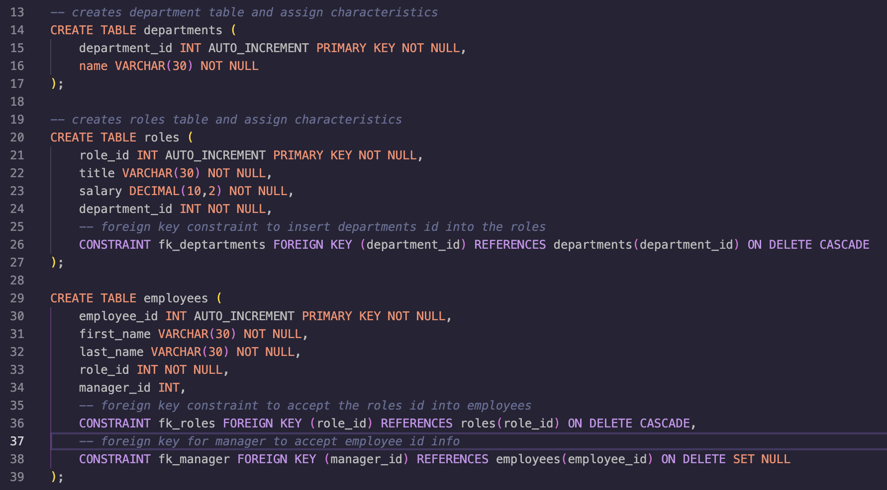
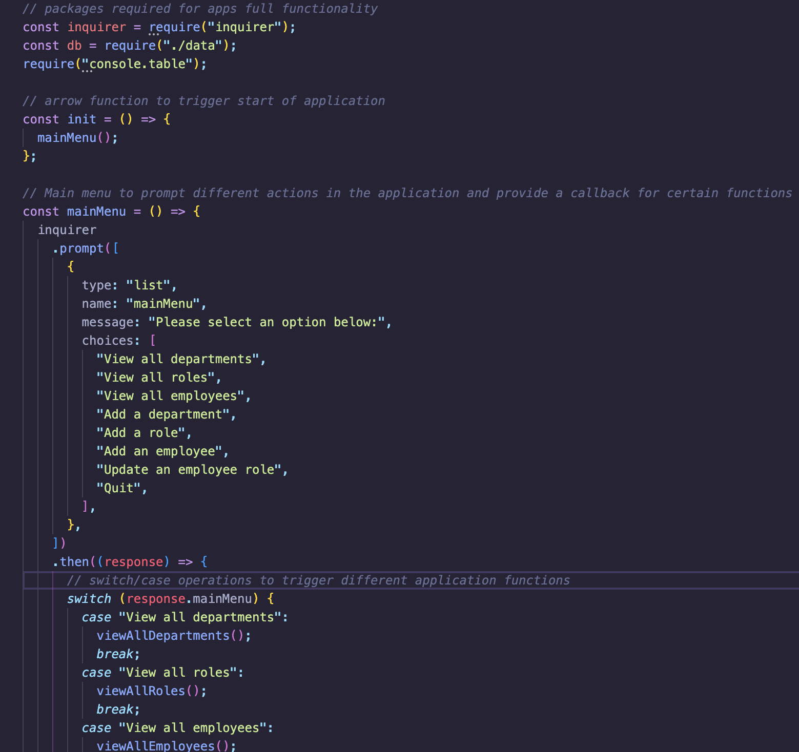
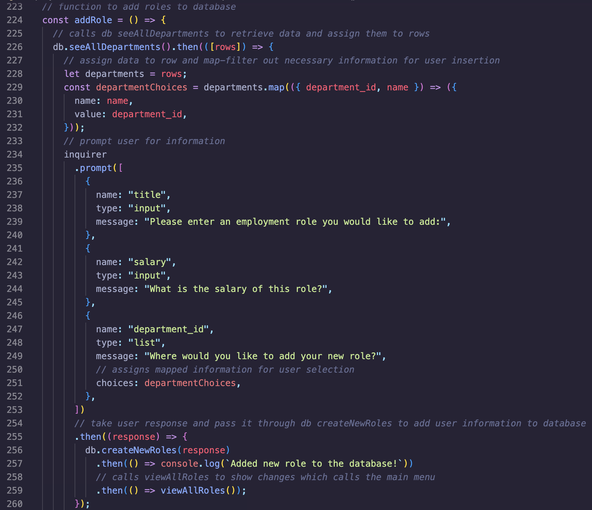

# Employee Tracker

## License
### 
### [MIT](https://opensource.org/licenses/MIT)

## Description

This project is a command line application that allows the user to track employee information including their department, role and information. This application allows for a quick and easy search of an employee databases and makes for smooth additions and adjustments without changing the codebase.

By: [Vincent Toon](https://github.com/vincenttoon)

## Table of Contents

* [Installation](#installation)

* [Usage](#usage)  

* [Contributors](#contributors)

* [Tests](#tests)

* [Challenges](#challenges)

* [Future Improvements](#future-improvements)

* [Questions](#questions)

## Installation

* Head to the repository to download or view this code: [Employee Tracker](https://github.com/Vincenttoon/employee-tracker-extraordinaire)

* Download code from codebase. 
* Run (npm i). 
* Install proper packages [npm i console.table](https://www.npmjs.com/package/console.table), [npm i inquirer](https://www.npmjs.com/package/inquirer), [npm i mysql2](https://www.npmjs.com/package/mysql2).
* Run "node index.js" and browse your choices.

## Tests

n/a
[Employee Tracker Video Demonstration](...)

## Usage

* This application uses a database created through mysql to create, store and update information.
(Ex. 1:)

* The application uses the inquirer package to gather user information and send that information through mysql code to generate desired results.
(Ex. 2:)

(Ex. 3:)

* The application allows for viewing, additions and updates to employee statuses
(Ex.4:)

## Contributors

* n/a

## Challenges

* The hardest part of this application was figuring out how to get the necessary user information properly passed through to the sql code

* Recalling information learned for the first time a couple lessons ago and building off of it

* Creating a Command Line Application when all previous MySQL practice was through a Front End Application

## Future Improvements

* Finish bonus point additions to this project (Update employee managers, view employees by manager, view employees by department, delete departments, roles, and employees, and view total utilized budget of a department)

## Questions?

Questions, comments, or concerns? Please Email me at:
* vincenttoon22@gmail.com
